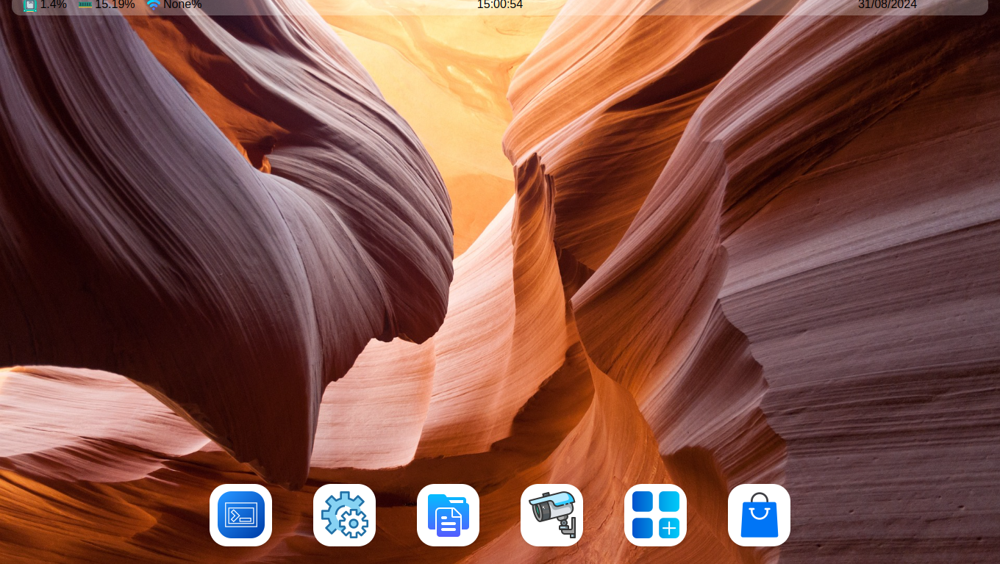
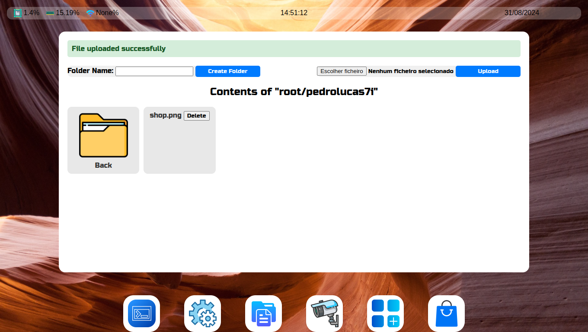
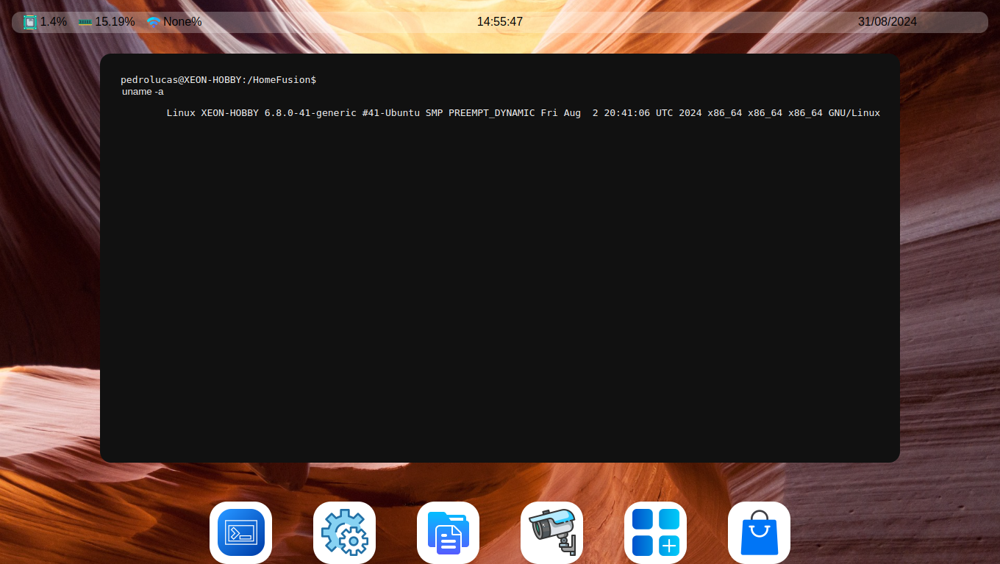
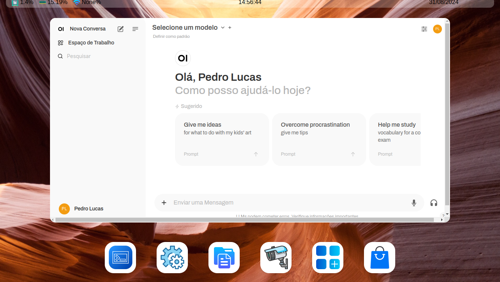

# HomeFusion
 A Home Server with many features

## Project Setup

Install MySQL Server:
```sh
sudo apt install mysql-server
```

Create venv (necessary):
```sh
python -m venv server
```

Install dependencies:
```sh
pip3 install -r requirements.txt
```

Paste the content of "db.sql" for mysql prompt

Copy the `.env` file:
```sh
cp .env.example .env
```

Change the .env to your configuration

## Login

Create the user and password for login:
```sh
python3 create_user_password.py
```

## Start Server Application

Run:
```sh
python3 app.py
```

## Result
### Files


### Prompt


### Ollama (AI)


